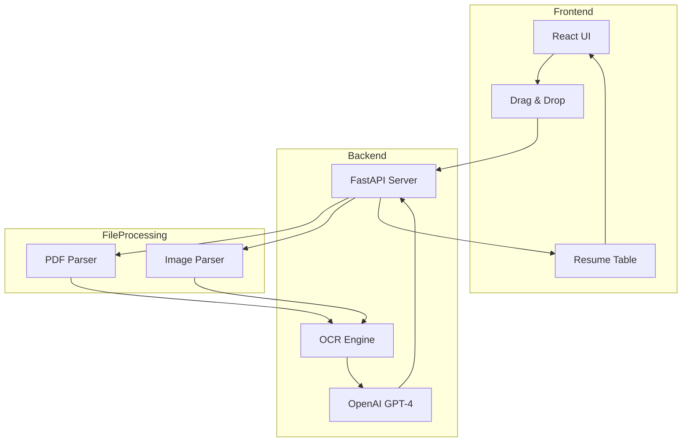
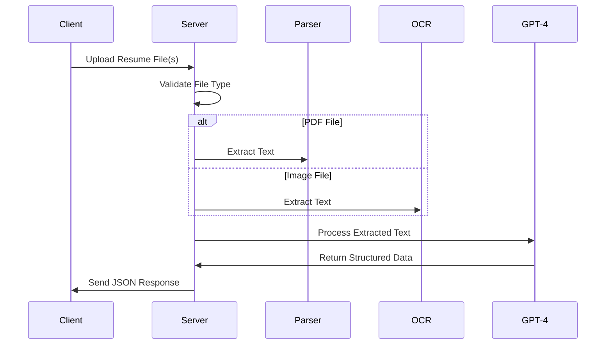

# ResumeOCR - AI-Powered Resume Parser

[](https://fastapi.tiangolo.com)
[](https://reactjs.org)
[](https://www.typescriptlang.org)
[](https://openai.com)

ResumeOCR is a modern web application that uses AI to extract and structure information from resumes in various formats (PDF, JPG, PNG). It provides an intuitive interface for uploading resumes and displays the parsed information in a clean, organized format.

## 🎯 Features

- 📄 Support for multiple file formats (PDF, JPG, PNG)
- 🤖 AI-powered information extraction using GPT-4
- 📊 Clean and organized data presentation
- 🔄 Real-time processing and feedback
- 💫 Smooth animations and modern UI
- 🎨 Responsive design

## 🖼️ Demo


[Add Demo Video Here]

## 🏗️ Architecture

### System Design


### API Flow


## 🛠️ Technical Stack

### Backend
- **Framework**: FastAPI
- **Language**: Python 3.8+
- **Key Libraries**:
  - pdfplumber (PDF parsing)
  - pytesseract (OCR)
  - OpenAI GPT-4 (AI text processing)
  - Pydantic (data validation)
  - CORS middleware (cross-origin support)

### Frontend
- **Framework**: React 18+
- **Language**: TypeScript
- **Key Libraries**:
  - Vite (build tool)
  - Axios (HTTP client)
  - Lucide React (icons)
  - Modern CSS (styling)

## 🚀 Getting Started

### Prerequisites
- Python 3.8+
- Node.js 14+
- Tesseract OCR
- OpenAI API key

### Backend Setup
1. Navigate to backend directory:
   ```bash
   cd backend
   ```

2. Install dependencies:
   ```bash
   pip install -r requirements.txt
   ```

3. Set up environment variables:
   ```bash
   export OPENAI_API_KEY="your-api-key"
   ```

4. Run the server:
   ```bash
   python main.py
   ```
   Server will run on http://localhost:8000

### Frontend Setup
1. Navigate to frontend directory:
   ```bash
   cd resumechatbot
   ```

2. Install dependencies:
   ```bash
   npm install
   ```

3. Run the development server:
   ```bash
   npm run dev
   ```
   Frontend will run on http://localhost:5173

## 📝 API Documentation

### POST /resume/extract
Extracts information from uploaded resume file(s).

**Request**:
- Method: POST
- Content-Type: multipart/form-data
- Body: files (PDF/JPG/PNG)

**Response**:
```json
{
  "extracted_data": {
    "full_name": "string",
    "email": "string",
    "phone_number": "string",
    "location": "string",
    "skills": ["string"],
    "experience_years": "string",
    "education": ["string"],
    "current_job": "string",
    "companies_worked_at": ["string"],
    "linkedin": "string",
    "certifications": ["string"]
  }
}
```

## 🔒 Security

- CORS configuration for controlled access
- File type validation
- Error handling and validation
- Rate limiting (TODO)
- Input sanitization

## 🌟 Future Enhancements

- [ ] Support for more file formats
- [ ] Batch processing
- [ ] Custom extraction fields
- [ ] Export functionality
- [ ] User authentication
- [ ] Resume comparison
- [ ] Analytics dashboard

## 🤝 Contributing

1. Fork the repository
2. Create your feature branch (`git checkout -b feature/amazing-feature`)
3. Commit your changes (`git commit -m 'Add some amazing feature'`)
4. Push to the branch (`git push origin feature/amazing-feature`)
5. Open a Pull Request

## 📄 License

This project is licensed under the MIT License - see the [LICENSE](LICENSE) file for details.

## 👏 Acknowledgments

- OpenAI for GPT-4 API
- FastAPI team
- React team
- All contributors